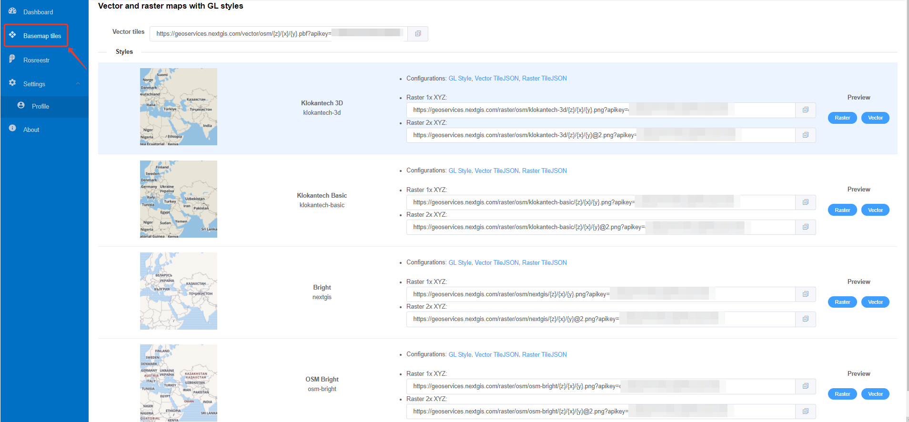

.. _nggeos_basemap_tiles:

Сервисы базовых подложек
========================

.. important::
   Данный инструмент доступен только владельцам `плана Premium <https://nextgis.ru/nextgis-com/plans>`_.

С помощью `NextGIS GeoServices <https://geoservices.nextgis.com/>`_ есть возможность подключить векторные и растровые карты с GL стилями:

1. Klokantech 3D
2. Klokantech Basic
3. Bright (nextgis)
4. OSM Bright (osm-bright)
 
 

 
   Сервисы базовых подложек NextGIS GeoServices
 
.. note:: 
	Для подключения данных необходим персональный `API ключ <https://docs.nextgis.ru/docs_geoservices/source/reissue_api_key.html>`_ (по умолчанию apikey находится в строке запроса, размыто на изображении). 
   
`Пример <https://demo.nextgis.ru/resource/5365>`_ подключения сервиса как `подложки <https://docs.nextgis.ru/docs_ngweb/source/webmaps_admin.html#ngw-map-basemaps>`_ в NextGIS Web.
